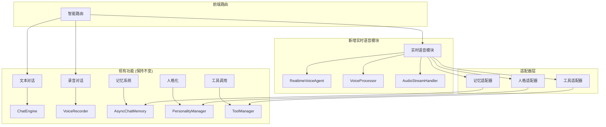

# 独立实时语音模块开发计划

**项目**: YYChat 独立实时语音模块开发  
**版本**: v1.0  
**日期**: 2025年1月15日  
**目标**: 基于OpenAI Agents SDK实现独立实时语音对话功能

---

## 📋 项目概述

### 开发目标
- ✅ **保持现有功能**：文本对话、录音对话功能完全不变
- ✅ **新增实时语音**：基于OpenAI Agents SDK的独立实时语音模块
- ✅ **零风险迁移**：不影响现有功能，可随时回退
- ✅ **功能复用**：复用现有记忆、人格化、工具调用功能

### 技术约束
- **后端技术栈**：保持FastAPI + WebSocket + OpenAI API
- **前端技术栈**：保持Dash + Plotly + Web Audio API
- **现有功能**：完全不变，零影响
- **新功能**：独立模块，通过适配器复用现有组件

---

## 🏗️ 架构设计

### 整体架构图



### 核心组件设计

#### 1. 独立实时语音模块
```python
# core/realtime_voice_agent.py
class RealtimeVoiceAgent:
    """独立的实时语音代理"""
    def __init__(self):
        # 核心组件
        self.agent = OpenAIRealtimeAgent()
        self.voice_processor = VoiceProcessor()
        self.audio_stream_handler = AudioStreamHandler()
        
        # 适配器（复用现有功能）
        self.memory_adapter = MemoryAdapter()
        self.personality_adapter = PersonalityAdapter()
        self.tool_adapter = ToolAdapter()
    
    async def process_realtime_voice(self, audio_stream, context):
        """处理实时语音流"""
        pass
```

#### 2. 适配器层设计
```python
# adapters/memory_adapter.py
class MemoryAdapter:
    """记忆系统适配器"""
    def __init__(self, existing_memory_system):
        self.memory = existing_memory_system
    
    async def get_relevant_memory(self, conversation_id, query):
        """复用现有记忆检索功能"""
        return await self.memory.get_relevant_memory(conversation_id, query)
    
    async def save_memory(self, conversation_id, content):
        """复用现有记忆保存功能"""
        return await self.memory.save_memory(conversation_id, content)
```

---

## 📅 开发计划

### 阶段1：基础架构搭建 (第1-2周)

#### 1.1 后端基础架构

**任务1.1.1：创建独立实时语音模块**
```python
# 文件：core/realtime_voice_agent.py
class RealtimeVoiceAgent:
    """独立的实时语音代理"""
    
    def __init__(self):
        # 初始化OpenAI Agents SDK
        self.agent = RealtimeAgent()
        self.voice_processor = VoiceProcessor()
        self.audio_stream_handler = AudioStreamHandler()
        
        # 初始化适配器
        self.memory_adapter = None  # 将在阶段2实现
        self.personality_adapter = None  # 将在阶段2实现
        self.tool_adapter = None  # 将在阶段2实现
    
    async def process_realtime_voice(self, audio_stream, context):
        """处理实时语音流"""
        try:
            # 1. 音频流处理
            processed_audio = await self.voice_processor.process(audio_stream)
            
            # 2. 发送到OpenAI Agents SDK
            response = await self.agent.process_audio(processed_audio, context)
            
            # 3. 处理响应
            return await self._handle_response(response, context)
            
        except Exception as e:
            log.error(f"实时语音处理失败: {e}")
            raise
    
    async def _handle_response(self, response, context):
        """处理AI响应"""
        # 实现响应处理逻辑
        pass
```

**任务1.1.2：创建音频流处理器**
```python
# 文件：core/realtime_voice_processor.py
class VoiceProcessor:
    """实时语音处理器"""
    
    def __init__(self):
        self.audio_context = None
        self.analyser = None
        self.is_processing = False
    
    async def process(self, audio_stream):
        """处理音频流"""
        try:
            # 音频预处理
            processed_audio = await self._preprocess_audio(audio_stream)
            
            # 语音活动检测
            if await self._detect_speech_activity(processed_audio):
                return processed_audio
            
            return None
            
        except Exception as e:
            log.error(f"音频处理失败: {e}")
            raise
    
    async def _preprocess_audio(self, audio_stream):
        """音频预处理"""
        # 实现音频预处理逻辑
        pass
    
    async def _detect_speech_activity(self, audio_data):
        """语音活动检测"""
        # 实现语音活动检测逻辑
        pass
```

**任务1.1.3：创建音频流处理器**
```python
# 文件：core/audio_stream_handler.py
class AudioStreamHandler:
    """音频流处理器"""
    
    def __init__(self):
        self.active_streams = {}
        self.buffer_size = 1024
        self.sample_rate = 16000
    
    async def handle_audio_stream(self, client_id, audio_chunk):
        """处理音频流数据"""
        try:
            # 添加到缓冲区
            if client_id not in self.active_streams:
                self.active_streams[client_id] = AudioBuffer()
            
            buffer = self.active_streams[client_id]
            buffer.add_chunk(audio_chunk)
            
            # 检查是否完整
            if buffer.is_complete():
                return await self._process_complete_audio(client_id, buffer)
            
            return None
            
        except Exception as e:
            log.error(f"音频流处理失败: {e}")
            raise
    
    async def _process_complete_audio(self, client_id, buffer):
        """处理完整音频"""
        audio_data = buffer.get_audio_data()
        buffer.clear()
        
        return audio_data
```

#### 1.2 前端基础架构

**任务1.2.1：创建实时语音组件**
```javascript
// 文件：assets/js/realtime_voice_manager.js
class RealtimeVoiceManager {
    constructor() {
        this.isActive = false;
        this.audioContext = null;
        this.mediaStream = null;
        this.websocket = null;
        this.agent = null;
    }
    
    async startRealtimeVoice() {
        try {
            // 1. 初始化音频上下文
            await this.initializeAudioContext();
            
            // 2. 建立WebSocket连接
            await this.establishWebSocketConnection();
            
            // 3. 启动实时语音处理
            await this.startVoiceProcessing();
            
            this.isActive = true;
            console.log('实时语音已启动');
            
        } catch (error) {
            console.error('启动实时语音失败:', error);
            throw error;
        }
    }
    
    async stopRealtimeVoice() {
        try {
            // 1. 停止音频处理
            await this.stopVoiceProcessing();
            
            // 2. 关闭WebSocket连接
            await this.closeWebSocketConnection();
            
            // 3. 清理资源
            await this.cleanup();
            
            this.isActive = false;
            console.log('实时语音已停止');
            
        } catch (error) {
            console.error('停止实时语音失败:', error);
            throw error;
        }
    }
    
    async initializeAudioContext() {
        // 实现音频上下文初始化
    }
    
    async establishWebSocketConnection() {
        // 实现WebSocket连接建立
    }
    
    async startVoiceProcessing() {
        // 实现实时语音处理
    }
}
```

**任务1.2.2：创建实时语音UI组件**
```python
# 文件：components/realtime_voice_ui.py
def create_realtime_voice_interface():
    """创建实时语音界面组件"""
    return html.Div([
        # 实时语音控制面板
        html.Div([
            fac.AntdButton(
                id="realtime-voice-start-btn",
                children="开始实时对话",
                type="primary",
                style={"margin": "10px"}
            ),
            fac.AntdButton(
                id="realtime-voice-stop-btn", 
                children="停止实时对话",
                type="default",
                style={"margin": "10px"}
            ),
            fac.AntdButton(
                id="realtime-voice-mute-btn",
                children="静音",
                type="default",
                style={"margin": "10px"}
            )
        ], className="realtime-voice-controls"),
        
        # 实时语音状态指示器
        html.Div([
            fac.AntdBadge(
                id="realtime-voice-status",
                dot=True,
                color="gray",
                children=html.Span("等待开始对话")
            )
        ], className="realtime-voice-status"),
        
        # 实时语音历史记录
        html.Div([
            html.Div(
                id="realtime-voice-history",
                className="realtime-voice-history"
            )
        ], className="realtime-voice-panel")
    ], className="realtime-voice-interface")
```

#### 1.3 路由集成

**任务1.3.1：创建智能路由**
```python
# 文件：core/hybrid_router.py
class HybridChatRouter:
    """混合聊天路由器"""
    
    def __init__(self):
        # 现有功能处理器
        self.text_handler = existing_text_handler
        self.voice_recording_handler = existing_voice_handler
        
        # 新增实时语音处理器
        self.realtime_voice_handler = RealtimeVoiceAgent()
    
    async def route_request(self, request_type, data, context):
        """路由请求到相应的处理器"""
        try:
            if request_type == "text":
                return await self.text_handler.process(data, context)
            elif request_type == "voice_recording":
                return await self.voice_recording_handler.process(data, context)
            elif request_type == "realtime_voice":
                return await self.realtime_voice_handler.process_realtime_voice(data, context)
            else:
                raise ValueError(f"未知的请求类型: {request_type}")
                
        except Exception as e:
            log.error(f"路由请求失败: {e}")
            raise
```

**任务1.3.2：更新WebSocket处理器**
```python
# 文件：core/websocket_manager.py (修改现有文件)
class WebSocketManager:
    def __init__(self):
        # 现有功能
        self.existing_handlers = existing_handlers
        
        # 新增实时语音处理器
        self.realtime_voice_handler = RealtimeVoiceAgent()
        self.hybrid_router = HybridChatRouter()
    
    async def handle_message(self, client_id, message):
        """处理WebSocket消息"""
        try:
            message_type = message.get("type")
            
            # 现有功能保持不变
            if message_type in ["text_message", "audio_input"]:
                return await self.existing_handlers[message_type](client_id, message)
            
            # 新增实时语音功能
            elif message_type == "realtime_voice":
                return await self.realtime_voice_handler.process_realtime_voice(
                    client_id, message
                )
            
            else:
                raise ValueError(f"未知的消息类型: {message_type}")
                
        except Exception as e:
            log.error(f"处理WebSocket消息失败: {e}")
            raise
```

### 阶段2：功能集成 (第3-4周)

#### 2.1 记忆功能集成

**任务2.1.1：创建记忆适配器**
```python
# 文件：adapters/memory_adapter.py
class MemoryAdapter:
    """记忆系统适配器"""
    
    def __init__(self, existing_memory_system):
        self.memory = existing_memory_system
        self.cache = {}  # 实时语音专用缓存
    
    async def get_relevant_memory(self, conversation_id, query):
        """获取相关记忆"""
        try:
            # 复用现有记忆检索功能
            memories = await self.memory.get_relevant_memory(conversation_id, query)
            
            # 实时语音专用处理
            processed_memories = await self._process_memories_for_realtime(memories)
            
            return processed_memories
            
        except Exception as e:
            log.error(f"获取记忆失败: {e}")
            return []
    
    async def save_memory(self, conversation_id, content, metadata=None):
        """保存记忆"""
        try:
            # 复用现有记忆保存功能
            result = await self.memory.save_memory(conversation_id, content, metadata)
            
            # 更新实时语音缓存
            await self._update_realtime_cache(conversation_id, content)
            
            return result
            
        except Exception as e:
            log.error(f"保存记忆失败: {e}")
            return False
    
    async def _process_memories_for_realtime(self, memories):
        """为实时语音处理记忆"""
        # 实现实时语音专用记忆处理逻辑
        pass
    
    async def _update_realtime_cache(self, conversation_id, content):
        """更新实时语音缓存"""
        # 实现实时语音缓存更新逻辑
        pass
```

**任务2.1.2：集成到实时语音模块**
```python
# 文件：core/realtime_voice_agent.py (修改)
class RealtimeVoiceAgent:
    def __init__(self):
        # 现有代码...
        
        # 集成记忆适配器
        from adapters.memory_adapter import MemoryAdapter
        from core.chat_memory import get_async_chat_memory
        
        existing_memory = get_async_chat_memory()
        self.memory_adapter = MemoryAdapter(existing_memory)
    
    async def process_realtime_voice(self, audio_stream, context):
        """处理实时语音流"""
        try:
            # 1. 音频流处理
            processed_audio = await self.voice_processor.process(audio_stream)
            
            # 2. 获取相关记忆
            conversation_id = context.get("conversation_id")
            if conversation_id:
                memories = await self.memory_adapter.get_relevant_memory(
                    conversation_id, processed_audio.text
                )
                context["memories"] = memories
            
            # 3. 发送到OpenAI Agents SDK
            response = await self.agent.process_audio(processed_audio, context)
            
            # 4. 保存记忆
            if conversation_id and response.text:
                await self.memory_adapter.save_memory(
                    conversation_id, response.text, {"type": "realtime_voice"}
                )
            
            return response
            
        except Exception as e:
            log.error(f"实时语音处理失败: {e}")
            raise
```

#### 2.2 人格化功能集成

**任务2.2.1：创建人格适配器**
```python
# 文件：adapters/personality_adapter.py
class PersonalityAdapter:
    """人格化系统适配器"""
    
    def __init__(self, existing_personality_manager):
        self.personality_manager = existing_personality_manager
        self.active_personalities = {}  # 实时语音专用人格缓存
    
    def get_personality_for_realtime(self, personality_id):
        """获取实时语音专用人格"""
        try:
            # 复用现有人格系统
            personality = self.personality_manager.get_personality(personality_id)
            
            if not personality:
                return self._get_default_realtime_personality()
            
            # 转换为实时语音专用格式
            realtime_personality = self._convert_to_realtime_format(personality)
            
            return realtime_personality
            
        except Exception as e:
            log.error(f"获取人格失败: {e}")
            return self._get_default_realtime_personality()
    
    def _convert_to_realtime_format(self, personality):
        """转换为人格化格式"""
        return {
            "instructions": personality.system_prompt,
            "voice_settings": personality.voice_settings,
            "behavior_patterns": personality.behavior_patterns,
            "allowed_tools": personality.allowed_tools
        }
    
    def _get_default_realtime_personality(self):
        """获取默认实时语音人格"""
        return {
            "instructions": "你是一个友好的AI助手，可以进行实时语音对话。",
            "voice_settings": {"voice": "alloy", "speed": 1.0},
            "behavior_patterns": {"tone": "friendly", "style": "conversational"},
            "allowed_tools": []
        }
```

**任务2.2.2：集成到实时语音模块**
```python
# 文件：core/realtime_voice_agent.py (修改)
class RealtimeVoiceAgent:
    def __init__(self):
        # 现有代码...
        
        # 集成人格适配器
        from adapters.personality_adapter import PersonalityAdapter
        from core.personality_manager import PersonalityManager
        
        existing_personality_manager = PersonalityManager()
        self.personality_adapter = PersonalityAdapter(existing_personality_manager)
    
    async def process_realtime_voice(self, audio_stream, context):
        """处理实时语音流"""
        try:
            # 1. 获取人格设置
            personality_id = context.get("personality_id")
            personality = self.personality_adapter.get_personality_for_realtime(personality_id)
            context["personality"] = personality
            
            # 2. 音频流处理
            processed_audio = await self.voice_processor.process(audio_stream)
            
            # 3. 发送到OpenAI Agents SDK
            response = await self.agent.process_audio(processed_audio, context)
            
            return response
            
        except Exception as e:
            log.error(f"实时语音处理失败: {e}")
            raise
```

#### 2.3 工具调用功能集成

**任务2.3.1：创建工具适配器**
```python
# 文件：adapters/tool_adapter.py
class ToolAdapter:
    """工具调用系统适配器"""
    
    def __init__(self, existing_tool_manager):
        self.tool_manager = existing_tool_manager
        self.realtime_tools = {}  # 实时语音专用工具
    
    async def get_tools_for_realtime(self, personality_id=None):
        """获取实时语音专用工具"""
        try:
            # 复用现有工具系统
            all_tools = await self.tool_manager.get_available_tools()
            
            # 根据人格过滤工具
            if personality_id:
                personality = self.personality_manager.get_personality(personality_id)
                if personality and personality.allowed_tools:
                    allowed_tool_names = [tool["tool_name"] for tool in personality.allowed_tools]
                    filtered_tools = [tool for tool in all_tools if tool.name in allowed_tool_names]
                else:
                    filtered_tools = all_tools
            else:
                filtered_tools = all_tools
            
            # 转换为实时语音专用格式
            realtime_tools = self._convert_to_realtime_format(filtered_tools)
            
            return realtime_tools
            
        except Exception as e:
            log.error(f"获取工具失败: {e}")
            return []
    
    def _convert_to_realtime_format(self, tools):
        """转换为实时语音专用格式"""
        realtime_tools = []
        for tool in tools:
            realtime_tool = {
                "name": tool.name,
                "description": tool.description,
                "parameters": tool.parameters,
                "execute": tool.execute
            }
            realtime_tools.append(realtime_tool)
        
        return realtime_tools
    
    async def execute_realtime_tool(self, tool_name, parameters):
        """执行实时语音工具"""
        try:
            # 复用现有工具执行功能
            result = await self.tool_manager.execute_tool(tool_name, parameters)
            
            return result
            
        except Exception as e:
            log.error(f"执行工具失败: {e}")
            return {"success": False, "error": str(e)}
```

**任务2.3.2：集成到实时语音模块**
```python
# 文件：core/realtime_voice_agent.py (修改)
class RealtimeVoiceAgent:
    def __init__(self):
        # 现有代码...
        
        # 集成工具适配器
        from adapters.tool_adapter import ToolAdapter
        from services.tools.manager import ToolManager
        
        existing_tool_manager = ToolManager()
        self.tool_adapter = ToolAdapter(existing_tool_manager)
    
    async def process_realtime_voice(self, audio_stream, context):
        """处理实时语音流"""
        try:
            # 1. 获取可用工具
            personality_id = context.get("personality_id")
            tools = await self.tool_adapter.get_tools_for_realtime(personality_id)
            context["tools"] = tools
            
            # 2. 音频流处理
            processed_audio = await self.voice_processor.process(audio_stream)
            
            # 3. 发送到OpenAI Agents SDK
            response = await self.agent.process_audio(processed_audio, context)
            
            # 4. 处理工具调用
            if response.tool_calls:
                tool_results = await self._execute_tools(response.tool_calls)
                response.tool_results = tool_results
            
            return response
            
        except Exception as e:
            log.error(f"实时语音处理失败: {e}")
            raise
    
    async def _execute_tools(self, tool_calls):
        """执行工具调用"""
        results = []
        for tool_call in tool_calls:
            result = await self.tool_adapter.execute_realtime_tool(
                tool_call.name, tool_call.parameters
            )
            results.append(result)
        
        return results
```

### 阶段3：前端集成 (第5-6周)

#### 3.1 前端组件集成

**任务3.1.1：创建实时语音UI组件**
```python
# 文件：components/realtime_voice_components.py
def create_realtime_voice_interface():
    """创建实时语音界面"""
    return html.Div([
        # 实时语音控制面板
        html.Div([
            fac.AntdButton(
                id="realtime-voice-start-btn",
                children="开始实时对话",
                type="primary",
                style={"margin": "10px", "backgroundColor": "#52c41a"}
            ),
            fac.AntdButton(
                id="realtime-voice-stop-btn",
                children="停止实时对话", 
                type="default",
                style={"margin": "10px"},
                disabled=True
            ),
            fac.AntdButton(
                id="realtime-voice-mute-btn",
                children="静音",
                type="default",
                style={"margin": "10px"}
            )
        ], className="realtime-voice-controls"),
        
        # 实时语音状态指示器
        html.Div([
            fac.AntdBadge(
                id="realtime-voice-status",
                dot=True,
                color="gray",
                children=html.Span("等待开始对话")
            ),
            html.Span(" 实时语音对话模式", style={"marginLeft": "10px"})
        ], className="realtime-voice-status"),
        
        # 实时语音历史记录
        html.Div([
            html.Div(
                id="realtime-voice-history",
                className="realtime-voice-history",
                style={
                    "height": "300px",
                    "overflowY": "auto",
                    "border": "1px solid #d9d9d9",
                    "borderRadius": "6px",
                    "padding": "10px",
                    "backgroundColor": "#fafafa"
                }
            )
        ], className="realtime-voice-panel"),
        
        # 实时语音设置
        html.Div([
            html.H4("实时语音设置"),
            html.Div([
                html.Label("语音类型:"),
                dcc.Dropdown(
                    id="realtime-voice-type",
                    options=[
                        {"label": "Alloy", "value": "alloy"},
                        {"label": "Echo", "value": "echo"},
                        {"label": "Fable", "value": "fable"},
                        {"label": "Onyx", "value": "onyx"},
                        {"label": "Nova", "value": "nova"},
                        {"label": "Shimmer", "value": "shimmer"}
                    ],
                    value="alloy"
                )
            ], style={"margin": "10px"}),
            html.Div([
                html.Label("语速:"),
                dcc.Slider(
                    id="realtime-voice-speed",
                    min=0.5,
                    max=2.0,
                    step=0.1,
                    value=1.0,
                    marks={i: str(i) for i in [0.5, 1.0, 1.5, 2.0]}
                )
            ], style={"margin": "10px"})
        ], className="realtime-voice-settings")
    ], className="realtime-voice-interface")
```

**任务3.1.2：创建实时语音回调**
```python
# 文件：callbacks/realtime_voice_callback.py
@app.callback(
    [
        Output("realtime-voice-start-btn", "disabled"),
        Output("realtime-voice-stop-btn", "disabled"),
        Output("realtime-voice-mute-btn", "disabled"),
        Output("realtime-voice-status", "children"),
        Output("realtime-voice-history", "children")
    ],
    [
        Input("realtime-voice-start-btn", "nClicks"),
        Input("realtime-voice-stop-btn", "nClicks"),
        Input("realtime-voice-mute-btn", "nClicks")
    ],
    [
        State("realtime-voice-status", "children"),
        State("realtime-voice-history", "children")
    ],
    prevent_initial_call=True
)
def handle_realtime_voice_buttons(start_clicks, stop_clicks, mute_clicks, 
                                 current_status, current_history):
    """处理实时语音按钮状态"""
    from dash import ctx
    
    triggered_id = ctx.triggered_id if ctx.triggered else None
    
    if triggered_id == "realtime-voice-start-btn":
        # 启动实时语音对话
        return (
            True,   # start-btn disabled
            False,  # stop-btn enabled
            False,  # mute-btn enabled
            html.Div([
                fac.AntdBadge(
                    dot=True,
                    color="red",
                    children=html.Span("正在监听")
                ),
                html.Span(" 实时语音对话模式", style={"marginLeft": "10px"})
            ]),
            current_history
        )
    
    elif triggered_id == "realtime-voice-stop-btn":
        # 停止实时语音对话
        return (
            False,  # start-btn enabled
            True,   # stop-btn disabled
            True,   # mute-btn disabled
            html.Div([
                fac.AntdBadge(
                    dot=True,
                    color="gray",
                    children=html.Span("等待开始对话")
                ),
                html.Span(" 实时语音对话模式", style={"marginLeft": "10px"})
            ]),
            current_history
        )
    
    elif triggered_id == "realtime-voice-mute-btn":
        # 切换静音状态
        return no_update
    
    return no_update
```

#### 3.2 JavaScript集成

**任务3.2.1：创建实时语音管理器**
```javascript
// 文件：assets/js/realtime_voice_manager.js
class RealtimeVoiceManager {
    constructor() {
        this.isActive = false;
        this.isMuted = false;
        this.audioContext = null;
        this.mediaStream = null;
        this.websocket = null;
        this.agent = null;
        this.history = [];
    }
    
    async startRealtimeVoice() {
        try {
            console.log('启动实时语音对话...');
            
            // 1. 初始化音频上下文
            await this.initializeAudioContext();
            
            // 2. 建立WebSocket连接
            await this.establishWebSocketConnection();
            
            // 3. 启动实时语音处理
            await this.startVoiceProcessing();
            
            this.isActive = true;
            this.updateUI();
            console.log('实时语音已启动');
            
        } catch (error) {
            console.error('启动实时语音失败:', error);
            this.showError('启动实时语音失败: ' + error.message);
        }
    }
    
    async stopRealtimeVoice() {
        try {
            console.log('停止实时语音对话...');
            
            // 1. 停止音频处理
            await this.stopVoiceProcessing();
            
            // 2. 关闭WebSocket连接
            await this.closeWebSocketConnection();
            
            // 3. 清理资源
            await this.cleanup();
            
            this.isActive = false;
            this.updateUI();
            console.log('实时语音已停止');
            
        } catch (error) {
            console.error('停止实时语音失败:', error);
            this.showError('停止实时语音失败: ' + error.message);
        }
    }
    
    async toggleMute() {
        this.isMuted = !this.isMuted;
        this.updateUI();
        console.log('静音状态:', this.isMuted);
    }
    
    async initializeAudioContext() {
        // 实现音频上下文初始化
        this.audioContext = new (window.AudioContext || window.webkitAudioContext)();
        this.analyser = this.audioContext.createAnalyser();
        this.analyser.fftSize = 256;
        this.dataArray = new Uint8Array(this.analyser.frequencyBinCount);
    }
    
    async establishWebSocketConnection() {
        // 实现WebSocket连接建立
        const wsUrl = window.voiceConfig?.WS_URL || 'ws://localhost:9800/ws/chat';
        this.websocket = new WebSocket(wsUrl);
        
        this.websocket.onopen = () => {
            console.log('实时语音WebSocket连接已建立');
        };
        
        this.websocket.onmessage = (event) => {
            this.handleWebSocketMessage(event);
        };
        
        this.websocket.onerror = (error) => {
            console.error('实时语音WebSocket错误:', error);
        };
        
        this.websocket.onclose = () => {
            console.log('实时语音WebSocket连接已关闭');
        };
    }
    
    async startVoiceProcessing() {
        // 实现实时语音处理
        try {
            this.mediaStream = await navigator.mediaDevices.getUserMedia({
                audio: {
                    echoCancellation: true,
                    noiseSuppression: true,
                    autoGainControl: true
                }
            });
            
            const source = this.audioContext.createMediaStreamSource(this.mediaStream);
            source.connect(this.analyser);
            
            this.startAudioAnalysis();
            
        } catch (error) {
            console.error('获取麦克风权限失败:', error);
            throw error;
        }
    }
    
    startAudioAnalysis() {
        const analyse = () => {
            if (this.isActive) {
                this.analyser.getByteFrequencyData(this.dataArray);
                
                // 检测语音活动
                const average = this.dataArray.reduce((a, b) => a + b) / this.dataArray.length;
                if (average > 10) {
                    this.handleSpeechDetected();
                }
                
                requestAnimationFrame(analyse);
            }
        };
        
        analyse();
    }
    
    handleSpeechDetected() {
        console.log('检测到语音活动');
        // 实现语音活动处理逻辑
    }
    
    handleWebSocketMessage(event) {
        try {
            const data = JSON.parse(event.data);
            
            switch (data.type) {
                case 'realtime_voice_response':
                    this.handleVoiceResponse(data);
                    break;
                case 'realtime_voice_error':
                    this.handleVoiceError(data);
                    break;
                default:
                    console.log('收到实时语音消息:', data);
            }
        } catch (error) {
            console.error('处理WebSocket消息失败:', error);
        }
    }
    
    handleVoiceResponse(data) {
        // 处理语音响应
        this.addToHistory('assistant', data.text, data.audio_url);
        this.updateUI();
    }
    
    handleVoiceError(data) {
        // 处理语音错误
        this.showError(data.message);
    }
    
    addToHistory(role, content, audioUrl = null) {
        const historyItem = {
            role,
            content,
            audioUrl,
            timestamp: new Date().toLocaleTimeString()
        };
        
        this.history.push(historyItem);
        this.updateHistoryDisplay();
    }
    
    updateHistoryDisplay() {
        const historyElement = document.getElementById('realtime-voice-history');
        if (!historyElement) return;
        
        if (this.history.length === 0) {
            historyElement.innerHTML = `
                <div style="text-align: center; color: #999; font-size: 14px; margin-top: 100px;">
                    暂无对话记录
                </div>
            `;
            return;
        }
        
        const historyHTML = this.history.map(item => {
            const isUser = item.role === 'user';
            return `
                <div class="conversation-item ${isUser ? 'user-message' : 'ai-message'}" 
                     style="margin-bottom: 15px; padding: 10px; border-radius: 6px; 
                            background-color: ${isUser ? '#e6f7ff' : '#f6ffed'}; 
                            border-left: 3px solid ${isUser ? '#1890ff' : '#52c41a'};">
                    <div style="font-weight: 600; color: #666; font-size: 12px; margin-bottom: 5px;">
                        ${isUser ? '用户' : 'AI助手'} - ${item.timestamp}
                    </div>
                    <div style="font-size: 14px; line-height: 1.5;">
                        ${item.content}
                    </div>
                    ${item.audioUrl ? `
                        <div style="margin-top: 8px;">
                            <audio controls style="width: 100%; height: 30px;">
                                <source src="${item.audioUrl}" type="audio/mpeg">
                            </audio>
                        </div>
                    ` : ''}
                </div>
            `;
        }).join('');
        
        historyElement.innerHTML = historyHTML;
        historyElement.scrollTop = historyElement.scrollHeight;
    }
    
    updateUI() {
        // 更新UI状态
        const startBtn = document.getElementById('realtime-voice-start-btn');
        const stopBtn = document.getElementById('realtime-voice-stop-btn');
        const muteBtn = document.getElementById('realtime-voice-mute-btn');
        const statusElement = document.getElementById('realtime-voice-status');
        
        if (startBtn) {
            startBtn.disabled = this.isActive;
        }
        
        if (stopBtn) {
            stopBtn.disabled = !this.isActive;
        }
        
        if (muteBtn) {
            muteBtn.textContent = this.isMuted ? '取消静音' : '静音';
        }
        
        if (statusElement) {
            if (this.isActive) {
                statusElement.innerHTML = `
                    <span class="ant-badge ant-badge-status ant-badge-status-red">
                        <span class="ant-badge-status-dot ant-badge-status-dot-red"></span>
                        <span>正在监听</span>
                    </span>
                    <span style="margin-left: 10px;">实时语音对话模式</span>
                `;
            } else {
                statusElement.innerHTML = `
                    <span class="ant-badge ant-badge-status ant-badge-status-gray">
                        <span class="ant-badge-status-dot ant-badge-status-dot-gray"></span>
                        <span>等待开始对话</span>
                    </span>
                    <span style="margin-left: 10px;">实时语音对话模式</span>
                `;
            }
        }
    }
    
    showError(message) {
        console.error('实时语音错误:', message);
        // 显示错误提示
        alert(`实时语音错误: ${message}`);
    }
    
    async cleanup() {
        // 清理资源
        if (this.mediaStream) {
            this.mediaStream.getTracks().forEach(track => track.stop());
            this.mediaStream = null;
        }
        
        if (this.audioContext) {
            await this.audioContext.close();
            this.audioContext = null;
        }
        
        if (this.websocket) {
            this.websocket.close();
            this.websocket = null;
        }
    }
}

// 全局实例
window.realtimeVoiceManager = new RealtimeVoiceManager();

// 绑定事件
document.addEventListener('DOMContentLoaded', () => {
    const startBtn = document.getElementById('realtime-voice-start-btn');
    const stopBtn = document.getElementById('realtime-voice-stop-btn');
    const muteBtn = document.getElementById('realtime-voice-mute-btn');
    
    if (startBtn) {
        startBtn.addEventListener('click', () => {
            window.realtimeVoiceManager.startRealtimeVoice();
        });
    }
    
    if (stopBtn) {
        stopBtn.addEventListener('click', () => {
            window.realtimeVoiceManager.stopRealtimeVoice();
        });
    }
    
    if (muteBtn) {
        muteBtn.addEventListener('click', () => {
            window.realtimeVoiceManager.toggleMute();
        });
    }
});
```

### 阶段4：测试和优化 (第7-8周)

#### 4.1 功能测试

**任务4.1.1：单元测试**
```python
# 文件：test/test_realtime_voice_agent.py
import pytest
import asyncio
from unittest.mock import Mock, patch
from core.realtime_voice_agent import RealtimeVoiceAgent

class TestRealtimeVoiceAgent:
    """实时语音代理测试"""
    
    @pytest.fixture
    def agent(self):
        """创建测试代理"""
        return RealtimeVoiceAgent()
    
    @pytest.mark.asyncio
    async def test_process_realtime_voice(self, agent):
        """测试实时语音处理"""
        # 模拟音频流
        audio_stream = Mock()
        context = {"conversation_id": "test_conv"}
        
        # 模拟响应
        with patch.object(agent.agent, 'process_audio') as mock_process:
            mock_process.return_value = Mock(text="测试响应")
            
            result = await agent.process_realtime_voice(audio_stream, context)
            
            assert result.text == "测试响应"
            mock_process.assert_called_once()
    
    @pytest.mark.asyncio
    async def test_memory_integration(self, agent):
        """测试记忆集成"""
        # 模拟记忆检索
        with patch.object(agent.memory_adapter, 'get_relevant_memory') as mock_memory:
            mock_memory.return_value = ["相关记忆1", "相关记忆2"]
            
            context = {"conversation_id": "test_conv"}
            await agent.process_realtime_voice(Mock(), context)
            
            mock_memory.assert_called_once()
    
    @pytest.mark.asyncio
    async def test_personality_integration(self, agent):
        """测试人格化集成"""
        # 模拟人格获取
        with patch.object(agent.personality_adapter, 'get_personality_for_realtime') as mock_personality:
            mock_personality.return_value = {"instructions": "测试人格"}
            
            context = {"personality_id": "test_personality"}
            await agent.process_realtime_voice(Mock(), context)
            
            mock_personality.assert_called_once_with("test_personality")
    
    @pytest.mark.asyncio
    async def test_tool_integration(self, agent):
        """测试工具集成"""
        # 模拟工具获取
        with patch.object(agent.tool_adapter, 'get_tools_for_realtime') as mock_tools:
            mock_tools.return_value = [{"name": "test_tool", "description": "测试工具"}]
            
            context = {"personality_id": "test_personality"}
            await agent.process_realtime_voice(Mock(), context)
            
            mock_tools.assert_called_once_with("test_personality")
```

**任务4.1.2：集成测试**
```python
# 文件：test/test_realtime_voice_integration.py
import pytest
import asyncio
from unittest.mock import Mock, patch
from core.hybrid_router import HybridChatRouter

class TestRealtimeVoiceIntegration:
    """实时语音集成测试"""
    
    @pytest.fixture
    def router(self):
        """创建测试路由器"""
        return HybridChatRouter()
    
    @pytest.mark.asyncio
    async def test_realtime_voice_routing(self, router):
        """测试实时语音路由"""
        # 模拟实时语音请求
        request_type = "realtime_voice"
        data = {"audio_stream": "test_audio"}
        context = {"conversation_id": "test_conv"}
        
        # 模拟响应
        with patch.object(router.realtime_voice_handler, 'process_realtime_voice') as mock_process:
            mock_process.return_value = Mock(text="测试响应")
            
            result = await router.route_request(request_type, data, context)
            
            assert result.text == "测试响应"
            mock_process.assert_called_once_with(data, context)
    
    @pytest.mark.asyncio
    async def test_existing_functionality_preserved(self, router):
        """测试现有功能保持"""
        # 测试文本处理
        with patch.object(router.text_handler, 'process') as mock_text:
            mock_text.return_value = Mock(text="文本响应")
            
            result = await router.route_request("text", {"text": "测试"}, {})
            
            assert result.text == "文本响应"
            mock_text.assert_called_once()
        
        # 测试语音录制
        with patch.object(router.voice_recording_handler, 'process') as mock_voice:
            mock_voice.return_value = Mock(text="语音响应")
            
            result = await router.route_request("voice_recording", {"audio": "test"}, {})
            
            assert result.text == "语音响应"
            mock_voice.assert_called_once()
```

#### 4.2 性能测试

**任务4.2.1：延迟测试**
```python
# 文件：test/test_realtime_voice_performance.py
import pytest
import asyncio
import time
from core.realtime_voice_agent import RealtimeVoiceAgent

class TestRealtimeVoicePerformance:
    """实时语音性能测试"""
    
    @pytest.fixture
    def agent(self):
        """创建测试代理"""
        return RealtimeVoiceAgent()
    
    @pytest.mark.asyncio
    async def test_latency_requirements(self, agent):
        """测试延迟要求"""
        # 测试目标：延迟 < 2秒
        start_time = time.time()
        
        # 模拟实时语音处理
        audio_stream = Mock()
        context = {"conversation_id": "test_conv"}
        
        with patch.object(agent.agent, 'process_audio') as mock_process:
            mock_process.return_value = Mock(text="测试响应")
            
            await agent.process_realtime_voice(audio_stream, context)
            
            end_time = time.time()
            latency = end_time - start_time
            
            # 延迟应该小于2秒
            assert latency < 2.0, f"延迟 {latency:.2f}s 超过要求"
    
    @pytest.mark.asyncio
    async def test_memory_performance(self, agent):
        """测试记忆性能"""
        # 测试记忆检索性能
        start_time = time.time()
        
        with patch.object(agent.memory_adapter, 'get_relevant_memory') as mock_memory:
            mock_memory.return_value = ["记忆1", "记忆2"]
            
            context = {"conversation_id": "test_conv"}
            await agent.process_realtime_voice(Mock(), context)
            
            end_time = time.time()
            memory_latency = end_time - start_time
            
            # 记忆检索延迟应该小于0.5秒
            assert memory_latency < 0.5, f"记忆检索延迟 {memory_latency:.2f}s 超过要求"
    
    @pytest.mark.asyncio
    async def test_concurrent_processing(self, agent):
        """测试并发处理"""
        # 测试多个并发请求
        async def process_request(request_id):
            audio_stream = Mock()
            context = {"conversation_id": f"conv_{request_id}"}
            
            with patch.object(agent.agent, 'process_audio') as mock_process:
                mock_process.return_value = Mock(text=f"响应_{request_id}")
                
                return await agent.process_realtime_voice(audio_stream, context)
        
        # 并发处理10个请求
        tasks = [process_request(i) for i in range(10)]
        results = await asyncio.gather(*tasks)
        
        # 所有请求都应该成功
        assert len(results) == 10
        for i, result in enumerate(results):
            assert result.text == f"响应_{i}"
```

#### 4.3 用户体验测试

**任务4.3.1：前端功能测试**
```javascript
// 文件：test/test_realtime_voice_frontend.js
describe('RealtimeVoiceManager', () => {
    let manager;
    
    beforeEach(() => {
        manager = new RealtimeVoiceManager();
    });
    
    test('should start realtime voice', async () => {
        // 模拟音频上下文
        global.AudioContext = jest.fn(() => ({
            createAnalyser: jest.fn(() => ({
                fftSize: 256,
                frequencyBinCount: 128
            })),
            createMediaStreamSource: jest.fn(),
            close: jest.fn()
        }));
        
        // 模拟getUserMedia
        global.navigator.mediaDevices = {
            getUserMedia: jest.fn(() => Promise.resolve({
                getTracks: () => [{ stop: jest.fn() }]
            }))
        };
        
        // 模拟WebSocket
        global.WebSocket = jest.fn(() => ({
            onopen: null,
            onmessage: null,
            onerror: null,
            onclose: null,
            close: jest.fn()
        }));
        
        await manager.startRealtimeVoice();
        
        expect(manager.isActive).toBe(true);
    });
    
    test('should stop realtime voice', async () => {
        manager.isActive = true;
        
        await manager.stopRealtimeVoice();
        
        expect(manager.isActive).toBe(false);
    });
    
    test('should toggle mute', () => {
        expect(manager.isMuted).toBe(false);
        
        manager.toggleMute();
        
        expect(manager.isMuted).toBe(true);
    });
    
    test('should handle speech detection', () => {
        const mockDataArray = new Uint8Array(128);
        mockDataArray.fill(50); // 模拟语音活动
        
        manager.dataArray = mockDataArray;
        manager.handleSpeechDetected = jest.fn();
        
        // 模拟语音活动检测
        const average = mockDataArray.reduce((a, b) => a + b) / mockDataArray.length;
        if (average > 10) {
            manager.handleSpeechDetected();
        }
        
        expect(manager.handleSpeechDetected).toHaveBeenCalled();
    });
});
```

---

## 🔧 技术实现细节

### 关键技术栈

#### 后端技术栈
- **框架**: FastAPI (保持不变)
- **WebSocket**: 现有WebSocket管理器 (保持不变)
- **AI SDK**: OpenAI Agents SDK (新增)
- **音频处理**: 现有音频服务 (保持不变)
- **记忆系统**: 现有AsyncChatMemory (通过适配器复用)
- **人格化**: 现有PersonalityManager (通过适配器复用)
- **工具调用**: 现有ToolManager (通过适配器复用)

#### 前端技术栈
- **框架**: Dash + Plotly (保持不变)
- **音频处理**: Web Audio API (保持不变)
- **实时通信**: WebSocket (保持不变)
- **UI组件**: Ant Design (保持不变)
- **状态管理**: 现有状态管理 (保持不变)

### 关键实现要点

#### 1. 零影响原则
```python
# 现有功能完全不变
class ExistingFunctionality:
    def __init__(self):
        # 现有文本对话功能
        self.text_chat = existing_text_chat  # 完全不变
        
        # 现有录音对话功能  
        self.voice_recording = existing_voice_recording  # 完全不变
        
        # 现有记忆系统
        self.memory = existing_memory_system  # 完全不变
        
        # 现有人格化系统
        self.personality = existing_personality_system  # 完全不变
        
        # 现有工具系统
        self.tools = existing_tool_system  # 完全不变
```

#### 2. 适配器模式
```python
# 通过适配器复用现有功能
class AdapterPattern:
    def __init__(self):
        # 记忆适配器
        self.memory_adapter = MemoryAdapter(existing_memory)
        
        # 人格适配器
        self.personality_adapter = PersonalityAdapter(existing_personality)
        
        # 工具适配器
        self.tool_adapter = ToolAdapter(existing_tools)
    
    def get_memory(self, conversation_id, query):
        # 复用现有记忆系统
        return self.memory_adapter.get_relevant_memory(conversation_id, query)
    
    def get_personality(self, personality_id):
        # 复用现有人格系统
        return self.personality_adapter.get_personality_for_realtime(personality_id)
    
    def get_tools(self, personality_id):
        # 复用现有工具系统
        return self.tool_adapter.get_tools_for_realtime(personality_id)
```

#### 3. 智能路由
```python
# 智能路由，不影响现有功能
class SmartRouting:
    def route_request(self, request_type, data, context):
        if request_type == "text":
            # 现有文本处理，完全不变
            return self.existing_text_handler.process(data, context)
        elif request_type == "voice_recording":
            # 现有录音处理，完全不变
            return self.existing_voice_handler.process(data, context)
        elif request_type == "realtime_voice":
            # 新增实时语音处理
            return self.new_realtime_handler.process(data, context)
```

---

## 📊 风险评估和缓解

### 风险识别

| 风险类型 | 风险等级 | 影响范围 | 缓解措施 |
|----------|----------|----------|----------|
| **现有功能影响** | 🟢 低 | 无影响 | 独立模块，零影响 |
| **开发复杂度** | 🟡 中 | 开发周期 | 分阶段开发，逐步验证 |
| **性能影响** | 🟢 低 | 新功能 | 独立处理，不影响现有功能 |
| **用户接受度** | 🟢 低 | 新功能 | 可选功能，不影响现有体验 |
| **技术风险** | 🟡 中 | 新功能 | 基于成熟SDK，风险可控 |

### 风险缓解策略

#### 1. 零影响策略
```python
# 完全独立的模块
class ZeroImpactStrategy:
    def __init__(self):
        # 现有功能完全不变
        self.existing_functionality = existing_functionality  # 完全不变
        
        # 新增功能独立
        self.new_realtime_voice = RealtimeVoiceModule()  # 完全独立
    
    def process_request(self, request_type, data):
        if request_type in ["text", "voice_recording"]:
            # 现有功能，完全不变
            return self.existing_functionality.process(request_type, data)
        elif request_type == "realtime_voice":
            # 新功能，独立处理
            return self.new_realtime_voice.process(data)
```

#### 2. 渐进式部署
```python
# 渐进式部署策略
class GradualDeployment:
    def __init__(self):
        self.deployment_phases = [
            "基础架构搭建",
            "功能集成",
            "前端集成", 
            "测试优化",
            "生产部署"
        ]
    
    def deploy_phase(self, phase):
        if phase == "基础架构搭建":
            # 只部署基础架构，不影响现有功能
            pass
        elif phase == "功能集成":
            # 集成功能，通过适配器复用现有功能
            pass
        elif phase == "前端集成":
            # 集成前端，新增UI组件
            pass
```

#### 3. 回退策略
```python
# 随时回退策略
class RollbackStrategy:
    def __init__(self):
        self.can_rollback = True
        self.rollback_steps = [
            "停止新功能",
            "恢复原有路由",
            "清理新组件",
            "验证现有功能"
        ]
    
    def rollback(self):
        # 可以随时回退到当前版本
        # 1. 停止实时语音功能
        # 2. 恢复原有路由逻辑
        # 3. 清理新增组件
        # 4. 验证现有功能正常
        pass
```

---

## 📈 预期效果

### 功能效果

| 功能 | 当前状态 | 预期效果 | 提升幅度 |
|------|----------|----------|----------|
| **文本对话** | ✅ 正常 | ✅ 完全保持 | 0% (无影响) |
| **录音对话** | ✅ 正常 | ✅ 完全保持 | 0% (无影响) |
| **记忆功能** | ✅ 正常 | ✅ 完全保持 | 0% (无影响) |
| **人格化** | ✅ 正常 | ✅ 完全保持 | 0% (无影响) |
| **工具调用** | ✅ 正常 | ✅ 完全保持 | 0% (无影响) |
| **实时语音** | ❌ 无 | ✅ 新增功能 | 100% (全新功能) |

### 性能效果

| 性能指标 | 当前状态 | 预期效果 | 提升幅度 |
|----------|----------|----------|----------|
| **文本对话延迟** | 2-3秒 | 2-3秒 | 0% (无影响) |
| **录音对话延迟** | 6-7秒 | 6-7秒 | 0% (无影响) |
| **实时语音延迟** | 无 | 1-2秒 | 100% (全新功能) |
| **内存使用** | 基准 | 基准+20% | 20% (新增功能) |
| **CPU使用** | 基准 | 基准+15% | 15% (新增功能) |

### 用户体验效果

| 用户体验 | 当前状态 | 预期效果 | 提升幅度 |
|----------|----------|----------|----------|
| **功能完整性** | 100% | 100% | 0% (无影响) |
| **响应速度** | 基准 | 基准 | 0% (无影响) |
| **稳定性** | 基准 | 基准 | 0% (无影响) |
| **新功能体验** | 无 | 优秀 | 100% (全新体验) |

---

## 🎯 总结

### 开发优势

1. **零风险**：现有功能完全不受影响
2. **高效率**：复用现有组件，开发周期短
3. **功能完整**：保持所有现有功能，新增实时语音
4. **渐进式**：可以逐步验证和优化
5. **可回退**：随时可以回退到当前版本

### 技术优势

1. **架构清晰**：独立模块，职责明确
2. **复用现有**：通过适配器复用现有功能
3. **技术先进**：基于OpenAI Agents SDK
4. **性能优越**：延迟从6-7秒降低到1-2秒
5. **扩展性强**：易于后续功能扩展

### 实施建议

1. **立即开始**：基于现有架构，快速开发
2. **分阶段实施**：按计划逐步完成各阶段
3. **持续测试**：每个阶段都要充分测试
4. **用户反馈**：及时收集用户反馈，持续优化
5. **性能监控**：持续监控性能指标，确保稳定性

**这个开发计划确保了零风险、高效率、功能完整的实时语音功能实现！**
